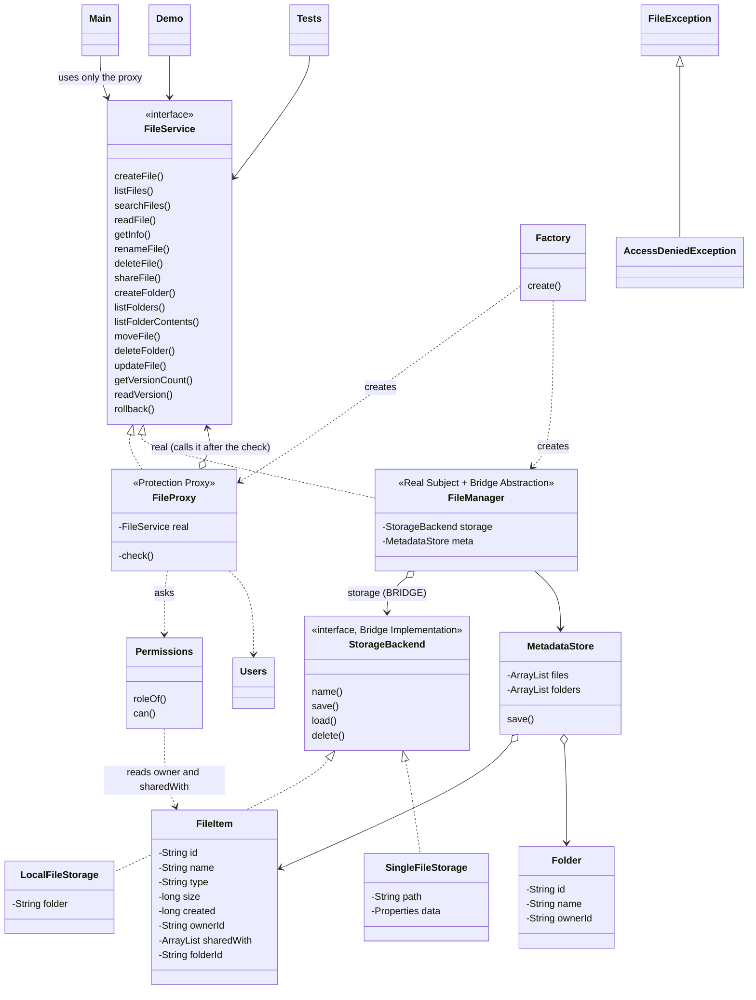

# UML Class Diagram - Option 1 - Version History

Mermaid diagram (shows in GitHub / VS Code preview, or paste into https://mermaid.live).

```mermaid
classDiagram
    class FileService {
        <<interface>>
        createFile()
        listFiles()
        searchFiles()
        readFile()
        getInfo()
        renameFile()
        deleteFile()
        shareFile()
        createFolder()
        listFolders()
        listFolderContents()
        moveFile()
        deleteFolder()
    }
    class FileProxy {
        <<Protection Proxy>>
        -FileService real
        -check()
    }
    class FileManager {
        <<Real Subject + Bridge Abstraction>>
        -StorageBackend storage
        -MetadataStore meta
    }
    class StorageBackend {
        <<interface, Bridge Implementation>>
        name()
        save()
        load()
        delete()
    }
    class LocalFileStorage {
        -String folder
    }
    class MetadataStore {
        -ArrayList files
        -ArrayList folders
        save()
    }
    class Permissions {
        roleOf()
        can()
    }
    class FileItem {
        -String id
        -String name
        -String type
        -long size
        -long created
        -String ownerId
        -ArrayList sharedWith
        -String folderId
    }
    class Folder {
        -String id
        -String name
        -String ownerId
    }
    class Users
    class Factory {
        create()
    }
    class Main
    class Demo
    class Tests
    class FileException
    class AccessDeniedException

    FileService <|.. FileProxy
    FileService <|.. FileManager
    FileProxy o--> FileService : real (calls it after the check)
    FileManager o--> StorageBackend : storage (BRIDGE)
    StorageBackend <|.. LocalFileStorage
    FileManager --> MetadataStore
    MetadataStore o--> FileItem
    MetadataStore o--> Folder
    FileProxy ..> Permissions : asks
    Permissions ..> FileItem : reads owner and sharedWith
    FileProxy ..> Users
    FileException <|-- AccessDeniedException
    Factory ..> FileProxy : creates
    Factory ..> FileManager : creates
    Main --> FileService : uses only the proxy
    Demo --> FileService
    Tests --> FileService

    FileService : updateFile()
    FileService : getVersionCount()
    FileService : readVersion()
    FileService : rollback()
    class SingleFileStorage {
        -String path
        -Properties data
    }
    StorageBackend <|.. SingleFileStorage
```
